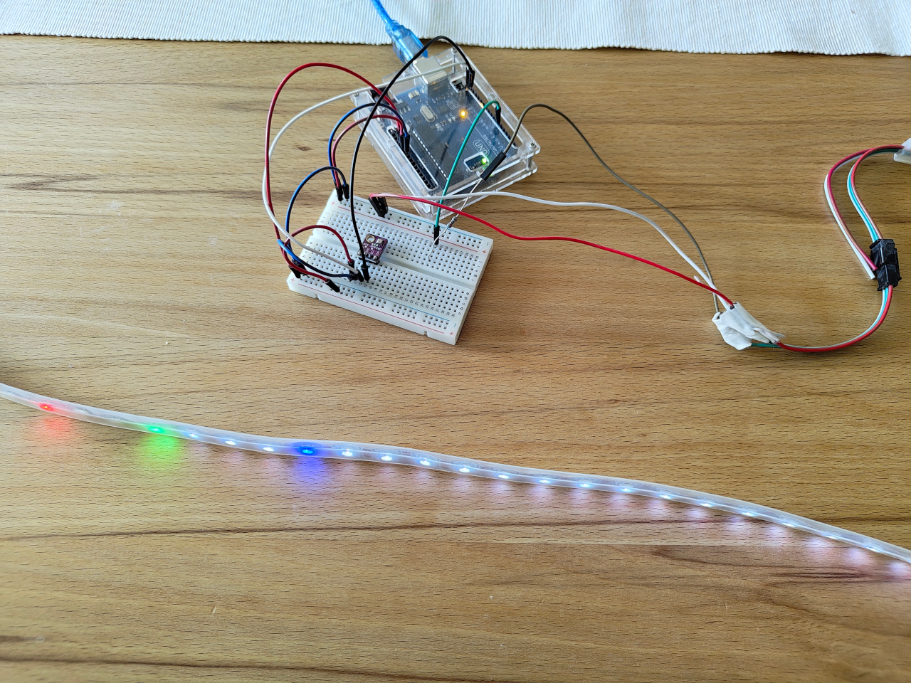

# Arduino_Temp
Analoges Thermometer mit LED-Streifen

Dieses Programm verhält sich wie ein analoges Thermometer.
Je wärmer desto mehr LEDs leuchten.

## Hardware

- Arduino Uno
- LED-Streifen mit 60 LEDs (Neopixel)
- Temperatursensor BMP280

## Verkabelung

Arduino - BMP280 / BME280
- 3.3V ---- VCC
- GND ----- GND
- SDA ----- SDA
- SCL ----- SCL

Arduino - Neopixel
- Pin 6 --- DIn
- 5V ------ +5V
- GND ----- GND

## Aufbau:

